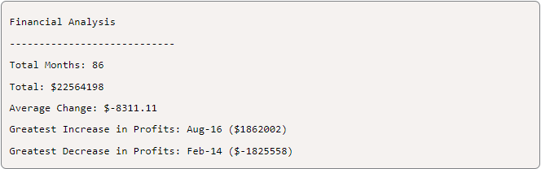
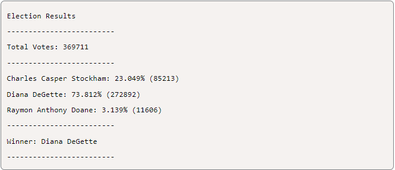

# python-challenge
Analyze financial and poll data with Python. The datasets are budget_data.csv and election_data.csv. Calculate metrics creating python script  to gain insights into financial performance and election outcomes.

## Background
In this assignment, I'll use the concepts I've learned to complete two Python challenges, PyBank and PyPoll. Both tasks present a real-world situation where my newly developed Python scripting skills come in handy.

### Before Beginning the Assignment
Before starting the project, complete the following steps:
- Create a new repository for the project named python-challenge.
- Clone the new repository to my computer.
- Create a folder for each Python assignment within my local Git repository and name them PyBank and PyPoll.
- In each folder that I just created, include the following items:
      - A new file named main.py. This file will be the primary script to execute for each analysis.
      - A Resources folder that holds the CSV files I will use. I should ensure that my script has the correct path to the CSV file.
      - An analysis folder that contains my text file, which includes the outcomes of my analysis.
- Finally, I should push these changes to GitHub or GitLab.

### PyBank Instructions
In this challenge, I will use a financial dataset called budget_data.csv which has two columns, "Date" and "Profit/Losses", to calculate each of the following values:
- The total number of months included in the dataset
- The net total amount of "Profit/Losses" over the entire period
- The changes in "Profit/Losses" over the entire period, and then the average of those changes
- The greatest increase in profits (date and amount) over the entire period
- The greatest decrease in profits (date and amount) over the entire period
My analysis should align with the following results:

Additionally, my final script should both print the analysis to the terminal and export a text file with the results.

### PyPoll Instructions
In this Challenge, I'll use a set of poll data called election_data.csv. The dataset is composed of three columns: "Voter ID", "County", and "Candidate". My task task is to create a Python script that analyzes the votes and calculates each of the following values:
- The total number of votes cast
- A complete list of candidates who received votes
- The percentage of votes each candidate won
- The total number of votes each candidate won
- The winner of the election based on popular vote

My analysis should align with the following results:

In addition, My final script should both print the analysis to the terminal and export a text file with the results.

#### Considerations
- Consider what I have learned so far. I have learned how to import modules like csv, read and write files in various formats, store    content in variables, lists, and dictionaries, iterate through basic data structures, and debug along the way. Using all that I have learned, I should try to break down my tasks into discrete mini-objectives.
- The datasets for these Challenges are quite large. This was done purposefully to showcase one of the limits of Excel-based analysis. As a data analyst, my first instinct is often to go straight to Excel, but creating scripts in Python can provide me with more powerful options for handling big data.
- I should write one script for each of the provided datasets and run each script separately to make sure that the code works for its respective dataset.
- I should always commit my work and back it up with pushes to GitHub or GitLab to avoid losing hours of hard work! Additionally, I should make sure that my repo has a detailed README.md file.

***Resources***

Data for this dataset was generated by edX Boot Camps LLC.

